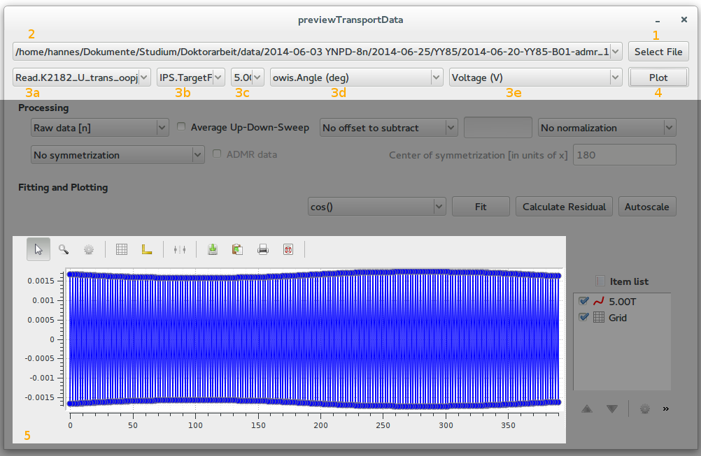
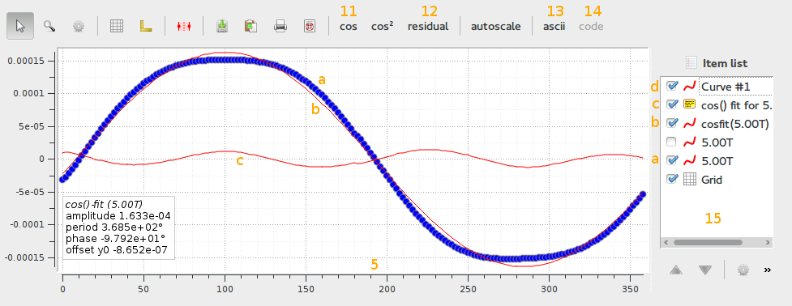

# previewTransportData

Small python tool to read and preprocess transport measurement data. This will allow to have a quick look at TMDS measurement data without the need to hack with origin.

## Conventions
… (few, the (anti-)symmetrization convention might change and is still to be properly documented in doc/symmetrization.md))
## Limitations/Known issues
… (many. also, the programm is still under heavy development and produces quite some debugging output to the console)
## Requirements 
… (quite some. python(x,y) and using spyder is a good way to start. a packed executable without dependencies will follow for windows)

## Features

The script allows you to 

  + load data from TDMS files (also undefragmented ones)
  + perform multiple data-processing operations (see below)
  + compare datasets
  + export the prescreened and processed data to ASCII, python-code and vector/bitmap-graphics

### Viewing ADMR measurements recorded w/ the delta method

In this section we will be concerned with quickly opening, viewing and fitting an ADMR measurment file.

#### Load and plot data

Select the TDMS measurement file by clicking "Select File" **(1)**. In this tutorial, the admr-example.tdms file from the doc/ folder is selected. Loading the TDMS file might take some time depending on the size of the measurement file as it's loaded as a whole into memory, this is due to the way the TDMS files are organized (there's a _lot_ of redundant data in our tdms files). Subsequent operations will be without such delays. When finished, the filename will show up selected in the TDMS file list **(2)** in the upper left of the window. 

Turn your attention to the drop down boxes in the second row **(3a..e)** now. 3a displays the measurement groups of the tdms file; only those containing "Read." will be shown here. Once you select a group here, the measurement channel boxes **(3b,d..e)** will be filled with the available channels. *For our example, select "Read.K2182_U_trans_oopj" in the group drop down now.*

  + In the first channel drop down box **(3a)** you can select a channel as parameter. Initially reads "No multiple fields in file" which means that (in the case of an ADMR experiment there only a single rotation at a fixed field has been recorded. Select your sweep channel to discrimitate different fields (or temperatures). The small middle drop down box **(3c)** then allows you to select the parameter. If you don't have a parameter in your measurement, leave it at "No multiple fields in file". *For our example, select "IPS.TargetField" here and "5.00T" in __(3c)__*. 
  + The second channel box **(3d)** is the channel of the X-Data. *In our example, select "owis.Angle (deg)" here*
  + The third channel box **(3e)** is the Y-Data channel. *Select here "Voltage (V)"*

Click "Plot" **(4)** to plot the selected X and Y channel. In the plot widget **(5)** a convoluted plot will be displayed with two overlaying sine curves from which you can't easily extract physics. Better delete this curve after having a look at the absolute values right away by right-clicking on the item labeled "5.00T" and selecting delete. 

#### Process data

By using the processing tools you can get a quick overview over the data, the UI elements are described here, examples follow below.

  + **(6)** Delta Method Combo Box: Allows to plot the raw data, only odd (Raw data [2n-1]) or even data points (Raw data [2n]) or to calculate the difference or sum between odd and even datapoints. 
  + **(7)** Average Up-Down-Sweep (only works properly when up- and down-sweep have the same number of points)
  + **(8)** Offset correction. Substract min/max/mean or a custom value. Only for substracting a custom value, type the value in field (8b)
  + **(9)** Normalization: Normalize to min/max of the y-values.
  + **(10a..c)**: Symmetrization of the signal. Discard (anti-)symmetric parts of the signal. If "ADMR data" **(10b)** is selected, the signal is expected to have a (anti-)symmetry with the period specified in **10c**. If "ADMR data" is unchecked, 10c specifies a central x-value and the expected symmetry is a point- resp. axis-symmetry around this value.
 

The order of these operations is: **(6)**, **(10)**, **(7)**, **(8)**, **(9)**. If you need a different order, programmatically reuse the DataObject class.

*In the above example, the "delta method" where for each angle point, the current direction is reversed, has been used to only select contributions to the signal that scale with an odd power of the current I ("Diff"). In an ADMR experiment, this is the Hall Voltage or an SMR/AMR effect. 
The signal has been antisymmetrized with a period of 180° which resulted in the sine-curve. There does not seem to be a major symmetric contribution (marked, grey curve).
__Note that the lavels of both curves are the same and there is no method yet to reconstruct which processing tools have been applied for which curve.__
To be able to compare the two contributions, they have been shifted to zero by their mean value __(8)__.*

#### Fit data

Fit data by selecting a curve in the item list **(15)** and clicking the appropriate function in the toolbar **(11)**. Currently, there's only a cosin and a cosin² fit available that should, however, be pretty robust for the task of fitting ADMR data. *In the example, __(a)__ is the data curve, __(b)__ the fitted function.* The fit parameters will show up in the python console and as info label **(c)** in the plot. You can copy values from the info label by opening the properties thereof.
To calculate the residual of the fit (or, as a matter of fact the difference between any two curves) select the two curves in the item list **(15)** and click on "Calculate Residual" **(12)**

#### Export data for further analysis
There are two methods planned to further analyse the data: 
 
  + Export to ascii: By selecting a curve in the curve item list **(15)**, you can export this curves processed data as whitespace spaced ASCII file. Also saved are the filename of the tdms file, the used channel and which processing steps have been taken to get there.
  + Export to python code: Export one or multiple DataObjects as python code that loads the data from TDMS and performs the processing steps again upon executing the script. This should be pretty straightforward and the data will be tied to a specific version of the software so you can track changes in the library. The processing library is decoupled of the user interface and is already documented and usable. You can find it under lib/.

Only the first method is implemented as of 2014-08-05. Guiqwt comes with export filters (buttons in the toolbar) for

  + PDF
  + PNG
  + copying the graph as bitmap to the clipboard

## Roadmap
  
  + <s>Show fit results in graph display as annotation</s>
  + Recover which data processing operations have been applied for which curve (groundworks layed, just an interface thing)
  + <s>Decouple Data object further and make it truely reusable</s> well under way
  + Add automatic color rotation to data
  + Clean up code and write more extensive, high level code documentation
  + Write down and graphically depict (anti-)symmetrization routine in doc/
  + Generalize "field channel" box to arbitrary parameters (that's just a naming issue. data-object is already prepared )